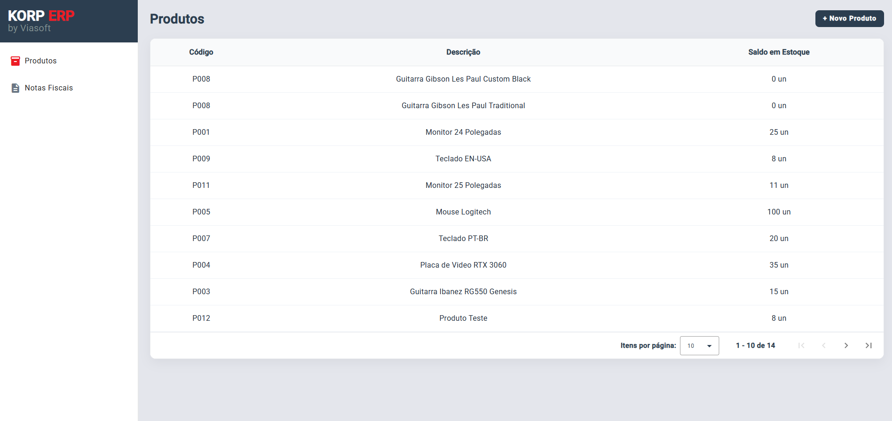
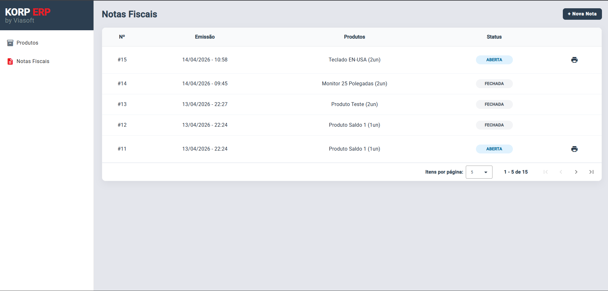
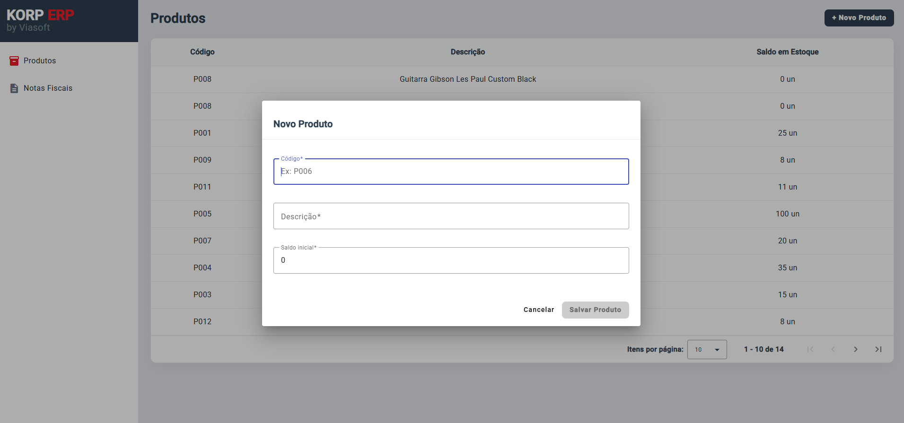
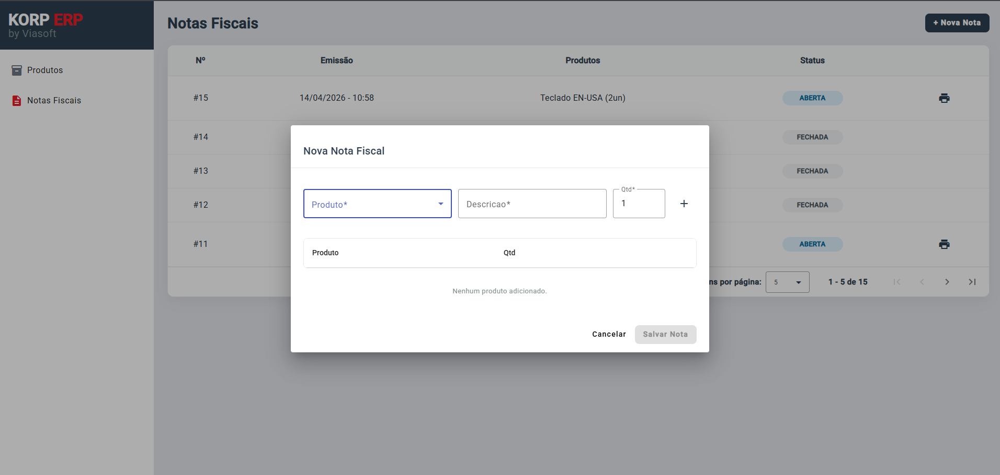

# KorpERP — Front-end

Aplicação em **Angular** para gestão de notas fiscais, com listagem e cadastro de produtos e notas fiscais.

---

## Preview

### Listagem de Produtos


### Listagem de Notas Fiscais


### Cadastro de Produto


### Cadastro de Nota Fiscal


---

## Tecnologias Utilizadas

| Tecnologia | Versão |
|---|---|
| Angular | 19.2.0 |
| Angular Material | 19.2.19 |
| Signals | (nativo Angular 19) |
| RxJS | ~7.8.0 |
| Reactive Forms | (nativo Angular) |

---

## Como Rodar o Projeto

### Pré-requisitos

- [Docker](https://www.docker.com/) instalado

### Com Docker Compose (recomendado)

```bash
docker compose up --build
```

A aplicação ficará disponível em **http://localhost:4200**.

> O `docker-compose.yml` realiza o build da imagem a partir do `Dockerfile` e expõe a porta `4200` mapeada para a porta `80` do container Nginx.

### Detalhes do build

O `Dockerfile` utiliza **multi-stage build**:

1. **Estágio `build`** — usa `node:20-alpine`, instala dependências e gera o bundle de produção via `ng build --configuration=production`.
2. **Estágio final** — serve os arquivos estáticos com `nginx:alpine` usando as configurações do `nginx.conf`.

### Rodando localmente (sem Docker)

Para rodar fora do Docker, altere o `src/environments/environment.ts` para usar as URLs locais das APIs:

```typescript
// Local (sem Docker)
export const environment = {
  estoqueApi: 'https://localhost:7250/api',
  faturamentoApi: 'https://localhost:7095/api'
};

// Docker
// export const environment = {
//   estoqueApi: '/api/estoque',
//   faturamentoApi: '/api/faturamento'
// };
```

Em seguida, execute:

```bash
npm install
ng serve
```

---

## Funcionalidades

- **Produtos**
  - Listagem paginada de produtos com código, descrição e saldo em estoque
  - Cadastro de novo produto

- **Notas Fiscais**
  - Listagem paginada de notas fiscais com número, data de emissão, produtos e status (Aberta / Fechada)
  - Cadastro de nova nota fiscal
  - Impressão de notas fiscais com status **Aberta**

---

## Estrutura do Projeto

```
src/
├── app/
│   ├── core/
│   │   ├── interceptors/       # Interceptors HTTP (ex: tratamento de erros)
│   │   ├── models/             # Interfaces e modelos de dados
│   │   └── services/           # Serviços de comunicação com a API
│   ├── features/
│   │   ├── notas-fiscais/
│   │   │   ├── nota-form/      # Formulário de cadastro de nota fiscal
│   │   │   └── notas-list/     # Listagem de notas fiscais
│   │   └── produtos/
│   │       ├── produto-form/   # Formulário de cadastro de produto
│   │       └── produtos-list/  # Listagem de produtos
│   └── shared/
│       └── components/
│           ├── loading/        # Componente de loading global
│           └── sidenav/        # Menu lateral de navegação
├── environments/               # Configurações de ambiente
├── styles.scss                 # Estilos globais
└── index.html
```

---

## Ciclos de Vida do Angular Utilizados

| Hook | Onde é usado | Descrição |
|---|---|---|
| `ngOnInit` | `produtos-list`, `notas-list` | Carrega a lista paginada ao inicializar o componente, chamando o respectivo service |

---

## Uso do RxJS

O RxJS é utilizado nos **services** (`produto.service.ts` e `nota-fiscal.service.ts`) para gerenciar as chamadas HTTP de forma reativa, compondo operadores em `pipe()`:

| Operador | Aplicação |
|---|---|
| `tap` | Atualiza os Signals de estado (`produtos`, `notas`, etc.) com os dados retornados pela API, sem interromper o fluxo |
| `finalize` | Desativa o indicador de `loading` ao fim da requisição, independente de sucesso ou erro |
| `catchError` + `throwError` | Captura erros nas requisições, loga no console e repropaga o erro para o componente tratar |
| `map` | Transforma os dados do fluxo quando necessário antes de emiti-los |
| `delay` | Aplicado na operação de impressão para simular o tempo de processamento antes de atualizar o status da nota |
